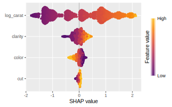

# {shapviz} <a href='https://github.com/ModelOriented/shapviz'></a>

<!-- badges: start -->

[](https://github.com/ModelOriented/shapviz/actions/workflows/R-CMD-check.yaml)
[](https://app.codecov.io/gh/ModelOriented/shapviz)
[](https://cran.r-project.org/package=shapviz)

[](https://cran.r-project.org/package=shapviz) 
[](https://cran.r-project.org/package=shapviz)

<!-- badges: end -->

## Overview

{shapviz} provides typical SHAP plots:

- `sv_importance()`: Importance plot (bar/beeswarm).
- `sv_dependence()` and `sv_dependence2D()`: Dependence plots to study feature effects and interactions.
- `sv_interaction()`: Interaction plot (beeswarm/bar).
- `sv_waterfall()`: Waterfall plot to study single or average predictions.
- `sv_force()`: Force plot as alternative to waterfall plot.

SHAP and feature values are stored in a "shapviz" object that is built from:

1. Models that know how to calculate SHAP values: XGBoost, LightGBM, and H2O.
2. SHAP crunchers like {fastshap}, {kernelshap}, {treeshap}, {fastr}, and {DALEX}.
3. SHAP matrix and corresponding feature values.

We use {patchwork} to glue together multiple plots with (potentially) inconsistent x and/or color scale.

## Installation

``` r
# From CRAN
install.packages("shapviz")

# Or the newest version from GitHub:
# install.packages("devtools")
devtools::install_github("ModelOriented/shapviz")
```

## Usage

Shiny diamonds... let's use XGBoost to model their prices by the four "C" variables:

```r
library(shapviz)
library(ggplot2)
library(xgboost)

set.seed(1)

xvars <- c("log_carat", "cut", "color", "clarity")
X <- diamonds |> 
  transform(log_carat = log(carat)) |> 
  subset(select = xvars)

# Fit (untuned) model
fit <- xgb.train(
  params = list(learning_rate = 0.1), 
  data = xgb.DMatrix(data.matrix(X), label = log(diamonds$price)),
  nrounds = 65
)

# SHAP analysis: X can even contain factors
X_explain <- X[sample(nrow(X), 2000), ]
shp <- shapviz(fit, X_pred = data.matrix(X_explain), X = X_explain)

sv_importance(shp, show_numbers = TRUE)
sv_importance(shp, kind = "bee")
sv_dependence(shp, v = xvars)  # multiple plots -> patchwork
```





Decompositions of individual predictions can be visualized as waterfall or force plot:

```r
sv_waterfall(shp, row_id = 2) +
  ggtitle("Waterfall plot for second prediction")
  
sv_force(shp, row_id = 2) +
  ggtitle("Force plot for second prediction")
```


## More to Discover

Check-out the vignettes for topics like:

- Basic use (includes working with other packages and SHAP interactions).
- Multiple models, multi-output models, and subgroup analyses.
- Plotting geographic effects.
- Working with Tidymodels.

## References

[1] Scott M. Lundberg and Su-In Lee. A Unified Approach to Interpreting Model Predictions. Advances in Neural Information Processing Systems 30 (2017).
