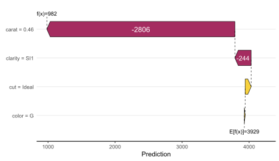
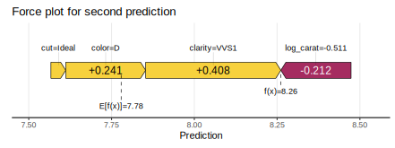
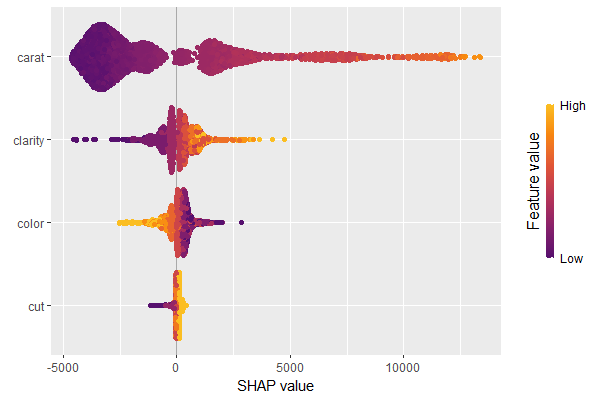
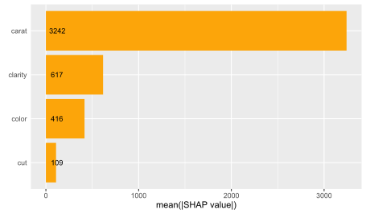
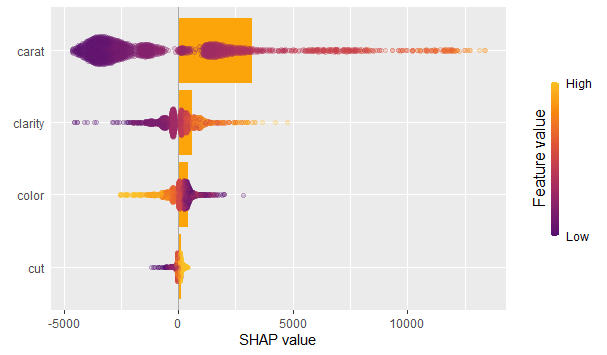
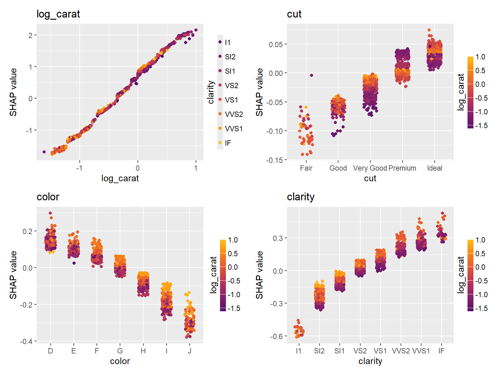

# shapviz <a href='https://github.com/mayer79/shapviz'></a>

## Introduction

SHAP (SHapley Additive exPlanations, [1]) is an ingenious way to study black box models. SHAP values decompose - as fair as possible - predictions into additive feature contributions. Crunching SHAP values requires clever algorithms by clever people. Analyzing them, however, is super easy with the right visualizations. The package `shapviz` offers the latter: 

- `sv_dependence()`: Dependence plots to study feature effects (optionally colored by heuristically strongest interacting feature).
- `sv_importance()`: Importance plots (bar and/or beeswarm plots) to study variable importance.
- `sv_waterfall()`: Waterfall plots to study single predictions.
- `sv_force()`: Force plots as an alternative to waterfall plots.

These plots require a `shapviz` object, which is built from two things only:

1. `S`: Matrix of SHAP values
2. `X`: Dataset with corresponding feature values

Furthermore, a `baseline` can be passed to represent an average prediction on the scale of the SHAP values.

A key feature of the `shapviz` package is that `X` is used for visualization only. Thus it is perfectly fine to use factor variables, even if the underlying model would not accept these.

To further simplify the use of `shapviz`, we added direct connectors to

- [`XGBoost`](https://CRAN.R-project.org/package=xgboost),
- [`LightGBM`](https://CRAN.R-project.org/package=lightgbm),
- [`fastshap`](https://CRAN.R-project.org/package=fastshap), and
- [`treeshap`](https://github.com/ModelOriented/treeshap).

## Installation

``` r
# From CRAN
install.packages("shapviz")

# Or the newest version from GitHub:
# install.packages("devtools")
devtools::install_github("shapviz")
```

## Example

Shiny diamonds... let's model their prices by four "c" variables with XGBoost:

### Model

```r
library(shapviz)
library(ggplot2)
library(xgboost)

set.seed(3653)

X <- diamonds[c("carat", "cut", "color", "clarity")]
dtrain <- xgb.DMatrix(data.matrix(X), label = diamonds$price)

fit <- xgb.train(
  params = list(learning_rate = 0.1, objective = "reg:squarederror"), 
  data = dtrain,
  nrounds = 65L
)
```

### Create `shapviz` object

One line of code creates a `shapviz` object. It contains SHAP values and feature values for the set of observations we are interested in. Note again that `X` is solely used as explanation dataset, not for calculating SHAP values. 

In this example we construct the `shapviz` object directly from the fitted XGBoost model. Thus we also need to pass a corresponding prediction dataset `X_pred` used for calculating SHAP values by XGBoost.

``` r
X_small <- X[sample(nrow(X), 2000L), ]

shp <- shapviz(fit, X_pred = data.matrix(X_small), X = X_small)
```

### Waterfall plot

Let's explain the first prediction by a waterfall plot:

``` r
sv_waterfall(shp, row_id = 1)
```



### Force plot

Or alternatively, by a force plot:

``` r
sv_force(shp, row_id = 1)
```



### Importance

We have decomposed 2000 predictions, not just one. This allows us to study variable importance at a global model level by studying average absolute SHAP values or by looking at beeswarm plots of SHAP values.

#### Beeswarm plot

``` r
sv_importance(shp)
```



#### Bar plot

``` r
sv_importance(shp, kind = "bar")
```



#### Or both combined

``` r
sv_importance(shp, kind = "bar", alpha = 0.2, width = 0.2)
```


### Depencence plot

A scatterplot of SHAP values of a feature like `color` against its observed values gives a great impression on the feature effect on the response. Vertical scatter gives additional info on interaction effects. `shapviz` offers a heuristic to pick another feature on the color scale with potential strongest interaction.

``` r
sv_dependence(shp, v = "color")
```



## More

Check out the package help and the vignette for further information.

## References

[1] Scott M. Lundberg and Su-In Lee. A Unified Approach to Interpreting Model Predictions. Advances in Neural Information Processing Systems 30 (2017).
