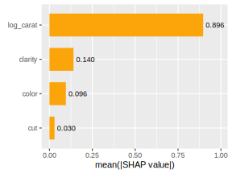

# {shapviz} <a href='https://github.com/ModelOriented/shapviz'></a>

<!-- badges: start -->

[](https://cran.r-project.org/package=shapviz)
[](https://github.com/ModelOriented/shapviz/actions)
[](https://app.codecov.io/gh/ModelOriented/shapviz?branch=main)

[](https://cran.r-project.org/package=shapviz) 
[](https://cran.r-project.org/package=shapviz)

<!-- badges: end -->

## Overview

{shapviz} provides typical SHAP plots:

- `sv_importance()`: Importance plots (bar plots and/or beeswarm plots).
- `sv_dependence()` and `sv_dependence2D()`: Dependence plots to study feature effects and interactions.
- `sv_interaction()`: Interaction plots.
- `sv_waterfall()`: Waterfall plots to study single predictions.
- `sv_force()`: Force plots as alternative to waterfall plots.

SHAP and feature values are stored in a "shapviz" object that is built from:

1. Models that know how to calculate SHAP values: XGBoost, LightGBM, h2o, or
2. SHAP crunchers like {fastshap}, {kernelshap}, {treeshap}, {fastr}, {DALEX}, or simply from a
3. SHAP matrix and its corresponding feature values. 

## Installation

``` r
# From CRAN
install.packages("shapviz")

# Or the newest version from GitHub:
# install.packages("devtools")
devtools::install_github("ModelOriented/shapviz")
```

## How to contribute

Contributions are very welcome!

1. The first step: open a Github issue to describe the problem or the missing feature.
2. Then, we check who will implement it. 

## Usage

Shiny diamonds... let's use XGBoost to model their prices by the four "C" variables:

```r
library(shapviz)
library(ggplot2)
library(xgboost)

set.seed(1)

# Build model
x <- c("carat", "cut", "color", "clarity")
dtrain <- xgb.DMatrix(data.matrix(diamonds[x]), label = diamonds$price)
fit <- xgb.train(params = list(learning_rate = 0.1), data = dtrain, nrounds = 65)

# SHAP analysis: X can even contain factors
dia_2000 <- diamonds[sample(nrow(diamonds), 2000), x]
shp <- shapviz(fit, X_pred = data.matrix(dia_2000), X = dia_2000)

sv_importance(shp, show_numbers = TRUE)
sv_dependence(shp, v = x)}
```




Decompositions of individual predictions can be visualized as waterfall or force plot:

```r
sv_waterfall(shp, row_id = 1)
sv_force(shp, row_id = 1)
```


## More to Discover

Check-out the vignettes. They cover topics like:

- How to work with other SHAP packages like {fastshap}, {kernelshap} or {treeshap}?
- How to make waterfall and force plots of single decompositions?
- SHAP interactions.
- Working with multiple models, multi-output models, subgroup analyses.
- Plotting geographic effects.

## References

[1] Scott M. Lundberg and Su-In Lee. A Unified Approach to Interpreting Model Predictions. Advances in Neural Information Processing Systems 30 (2017).
