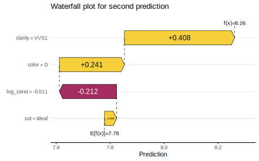

# shapviz <a href='https://github.com/mayer79/shapviz'></a>

<!-- badges: start -->

[](https://cran.r-project.org/package=shapviz)
[](https://github.com/ModelOriented/shapviz/actions)
[](https://app.codecov.io/gh/ModelOriented/shapviz?branch=main)

[](https://cran.r-project.org/package=shapviz) 
[](https://cran.r-project.org/package=shapviz)

<!-- badges: end -->

## Introduction

SHAP (SHapley Additive exPlanations, [1]) is an ingenious way to study black box models. SHAP values decompose - as fair as possible - predictions into additive feature contributions. Crunching SHAP values requires clever algorithms by clever people. Analyzing them, however, is super easy with the right visualizations. {shapviz} offers the latter: 

- `sv_dependence()`: Dependence plots to study feature effects and interactions.
- `sv_importance()`: Importance plots (bar plots and/or beeswarm "summary" plots) to study variable importance.
- `sv_interaction()`: Interaction plots.
- `sv_waterfall()`: Waterfall plots.
- `sv_force()`: Force plots as an alternative to waterfall plots.

These plots require a "shapviz" object, which is built from two things only:

1. `S`: Matrix of SHAP values
2. `X`: Dataset that includes the corresponding feature values

Optionally, a `baseline` can be passed to represent an average prediction on the scale of the SHAP values. Also a 3D array of SHAP interaction values can be passed as `S_inter`.

A key feature of "shapviz" is that `X` is used for visualization only. Thus it is perfectly fine to use factor variables, even if the underlying model would not accept these.
Additionally, in order to improve visualization, it can sometimes make sense to clip gross outliers, take logarithms for certain columns, or replace missing values by some explicit value.

To further simplify the use of {shapviz}, we added direct connectors to:

- [`XGBoost`](https://CRAN.R-project.org/package=xgboost)
- [`LightGBM`](https://CRAN.R-project.org/package=lightgbm)
- [`h2o`](https://CRAN.R-project.org/package=h2o)
- [`kernelshap`](https://CRAN.R-project.org/package=kernelshap)
- [`fastshap`](https://CRAN.R-project.org/package=fastshap)
- [`shapr`](https://CRAN.R-project.org/package=shapr)
- [`treeshap`](https://github.com/ModelOriented/treeshap)
- [`DALEX`](https://cran.r-project.org/web/packages/DALEX)

For XGBoost, LightGBM, and H2O, the SHAP values are directly calculated from the fitted model.

[`CatBoost`](https://github.com/catboost) is not included, but see the vignette how to use its SHAP calculation backend with {shapviz}.

## Installation

``` r
# From CRAN
install.packages("shapviz")

# Or the newest version from GitHub:
# install.packages("devtools")
devtools::install_github("mayer79/shapviz")
```

## Example

Shiny diamonds... let's model their prices by four "c" variables with XGBoost:

### Model

```r
library(shapviz)
library(ggplot2)
library(xgboost)

set.seed(3653)

x <- c("carat", "cut", "color", "clarity")
dtrain <- xgb.DMatrix(data.matrix(diamonds[x]), label = diamonds$price)

fit <- xgb.train(
  params = list(learning_rate = 0.1, objective = "reg:squarederror"), 
  data = dtrain,
  nrounds = 65L
)
```

### Create "shapviz" object

One line of code creates a "shapviz" object. It contains SHAP values and feature values for the set of observations we are interested in. Note again that `X` is solely used as explanation dataset, not for calculating SHAP values. 

In this example, we construct the "shapviz" object directly from the fitted XGBoost model. Thus we also need to pass a corresponding prediction dataset `X_pred` used for calculating SHAP values by XGBoost.

``` r
dia_small <- diamonds[sample(nrow(diamonds), 2000L), ]

shp <- shapviz(fit, X_pred = data.matrix(dia_small[x]), X = dia_small)
```

Note: If `X_pred` would contain one-hot-encoded dummy variables, their SHAP values (and also SHAP interaction values) could be collapsed by the `collapse` argument of `shapviz()`.

### Waterfall plot

Let's explain the first prediction by a waterfall plot:

``` r
sv_waterfall(shp, row_id = 1)
```



### Force plot

Or alternatively, by a force plot:

``` r
sv_force(shp, row_id = 1)
```


### Aggregated SHAP values

Also multiple `row_id` can be passed to `sv_waterfall()` and `sv_force()`: The SHAP values of the selected observations are averaged and then plotted as *aggregated SHAP values*: The prediction profile for beautiful color "D" diamonds:

``` r
sv_waterfall(shp, shp$X$color == "D")
```


### Importance

We have decomposed 2000 predictions, not just one. This allows us to study variable importance at a global model level by studying average absolute SHAP values or by looking at beeswarm "summary" plots of SHAP values.

#### Bar plot

``` r
sv_importance(shp)
```


#### Beeswarm plot

``` r
sv_importance(shp, kind = "beeswarm")
```


#### Or both combined

``` r
sv_importance(shp, kind = "both", show_numbers = TRUE, bee_width = 0.2)
```


### Dependence plot

A scatterplot of SHAP values of a feature like `color` against its observed values gives a great impression on the feature effect on the response. Vertical scatter gives additional info on interaction effects (using a heuristic to select the feature on the color axis).

``` r
sv_dependence(shp, v = "color")
```


### Interactions

If SHAP interaction values have been computed (via XGBoost or {treeshap}), the dependence plot can focus on main effects or SHAP interaction effects (multiplied by two due to symmetry):

``` r
shp_with_inter <- shapviz(
  fit, X_pred = data.matrix(dia_small[x]), X = dia_small, interactions = TRUE
)

sv_dependence(shp_with_inter, v = "color", color_var = "cut", interactions = TRUE)
```


We can also study all interactions and main effects together using the following beeswarm visualization:

```{r}
sv_interaction(shp_with_inter) +
  theme(axis.text.x = element_text(angle = 45, vjust = 1, hjust = 1))
```


## More

Check out the package help and the vignette for further information.

## References

[1] Scott M. Lundberg and Su-In Lee. A Unified Approach to Interpreting Model Predictions. Advances in Neural Information Processing Systems 30 (2017).
