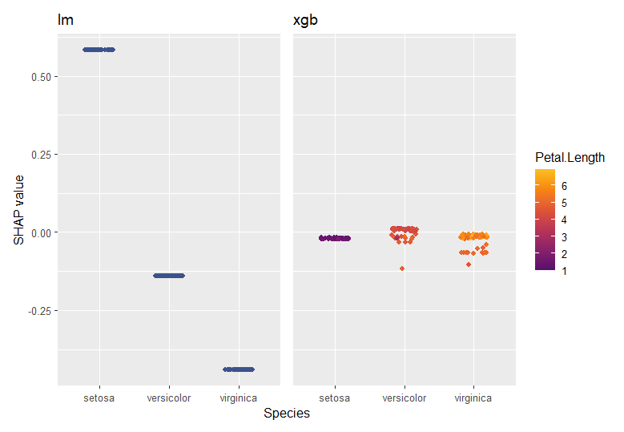

```{r, include = FALSE}
knitr::opts_chunk$set(
  collapse = TRUE,
  comment = "#>",
  warning = FALSE,
  message = FALSE,
  fig.height = 8, 
  fig.width = 7,
  fig.align = "center"
)
```

## Introduction

In certain situations, you will find it necessary to work with several "shapviz" objects at the same time:

1. Multiclass models fitted via XGBoost or LightGBM return SHAP values per class.
2. {kernelshap} returns SHAP values per class/response for corresponding models.
3. Compare SHAP plots of different models.
4. Study SHAP plots for different subgroups.

The [{patchwork}](https://cran.r-project.org/web/packages/patchwork) package allows to glue together the resulting plots.

To simplify the workflow, multiple "shapviz" objects can be combined together to a "mshapviz" object. This object will care about calling {patchwork}. 

## How to construct a "mshapviz" object?

There are different options:

- Use `shapviz()` on multiclass XGBoost or LightGBM models.
- Use `shapviz()` on "kernelshap" objects created from multiclass/multioutput models.
- Use `c(Mod_1 = s1, Mod_2 = s2, ...)` on "shapviz" objects `s1`, `s2`, ...
- Or `mshapviz(list(Mod_1 = s1, Mod_2 = s2, ...))`

## Example: Multiclass model

### Fit classification model

```{r}
library(xgboost)
library(ggplot2)
library(shapviz)
library(patchwork)

params <- list(objective = "multi:softprob", num_class = 3L)
X_pred <- data.matrix(iris[, -5L])
dtrain <- xgb.DMatrix(X_pred, label = as.integer(iris[, 5L]) - 1L)
fit <- xgb.train(params = params, data = dtrain, nrounds = 50L)
```

### Create "mshapviz" object (logit scale)

Note that TreeSHAP produces SHAP values on link scale, i.e., on logit scale.

```{r}
x <- shapviz(fit, X_pred = X_pred, X = iris)
x

# Contains "shapviz" objects for all classes
all.equal(x[[3L]], shapviz(fit, X_pred = X_pred, X = iris, which_class = 3L))

# Better names
names(x) <- levels(iris$Species)
x
```
### Force plot

```{r}
sv_force(x, row_id = 101L)
```

### Summary plot

```{r}
sv_importance(x, kind = "bee") +
  plot_layout(ncol = 1L)
```

### Dependence plot

Here, we will use better class names as well as identical coordinate systems.

```{r}
names(x) <- levels(iris$Species)

sv_dependence(x, v = "Petal.Length") +
  plot_layout(ncol = 1L) & 
  xlim(1, 7) &
  ylim(-3, 4)
```

### Similar for LightGBM (only code)

```r
library(lightgbm)

# Model
params <- list(objective = "multiclass", num_class = 3L)
X_pred <- data.matrix(iris[, -5L])
dtrain <- lgb.Dataset(X_pred, label = as.integer(iris[, 5L]) - 1L)
fit <- lgb.train(params = params, data = dtrain, nrounds = 50L)

# "mshapviz" object
x <- shapviz(fit, X_pred = X_pred, X = iris)
all.equal(x[[3L]], shapviz(fit, X_pred = X_pred, X = iris, which_class = 3L))

sv_importance(x, show_numbers = TRUE) +
  plot_layout(ncol = 1L) &
  xlim(0, 2.25)
```

### And for random forest and kernelshap (only code)

Since Kernel SHAP is model agnostic, we can get SHAP values on probability scale.

```r
library(ranger)
library(kernelshap)

# Model
fit <- ranger(Species ~ ., data = iris, num.trees = 100L, probability = TRUE)

# "mshapviz" object
x <- kernelshap(fit, X = iris, bg_X = iris)
shp <- setNames(shapviz(x), levels(iris$Species))
all.equal(shp[[3L]], shapviz(x, which_class = 3L))

sv_dependence(shp, v = "Sepal.Width") +
  plot_layout(ncol = 1L) &
  ylim(-0.025, 0.03)
```


## Example: SHAP subgroup analysis

Here, we want to compare SHAP dependence plots across Species subgroups.

### Fit regression model

```{r}
X_pred <- data.matrix(iris[, -1L])
dtrain <- xgb.DMatrix(X_pred, label = iris[, 1L])
fit_xgb <- xgb.train(data = dtrain, nrounds = 50L)
```

### Create "mshapviz" object

```{r}
shap_xgb <- shapviz(fit_xgb, X_pred = X_pred, X = iris)
x_subgroups <- c(
  setosa     = shap_xgb[iris$Species == "setosa"],
  versicolor = shap_xgb[iris$Species == "versicolor"],
  virginica  = shap_xgb[iris$Species == "virginica"]
)
```

### Dependence plot

```{r}
sv_dependence(x_subgroups, v = "Petal.Length") +
  plot_layout(ncol = 1L) & 
  xlim(1, 7) &
  ylim(-1.4, 2.2)
```

## Example: Different models

In the last example, we used a regression model fitted via XGBoost. How does it compare with a linear regression?

### Fit linear regression and use {kernelshap} to get SHAP values

```r
library(kernelshap)

fit_lm <- lm(Sepal.Length ~ ., data = iris)
shap_lm <- shapviz(kernelshap(fit_lm, iris[-1L], bg_X = iris))
```

### Combine "shapviz" objects

```r
mshap <- c(lm = shap_lm, xgb = shap_xgb)
mshap

#> 'mshapviz' object representing 2 'shapviz' objects:
#>   'lm': 150 x 4 SHAP matrix
#>   'xgb': 150 x 4 SHAP matrix
```

### SHAP importance plot

```r
sv_importance(mshap)
```


### SHAP dependence plot

```r
sv_dependence(mshap, v = "Species") &
  ylim(-0.5, 0.6)
```



