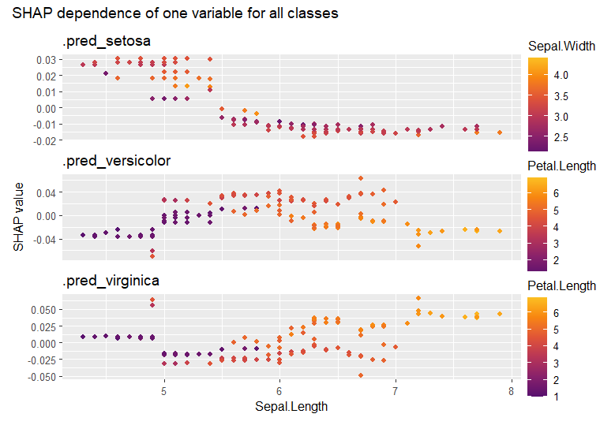
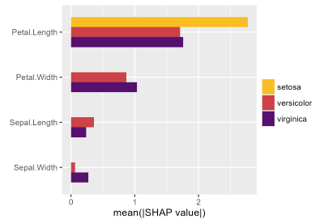
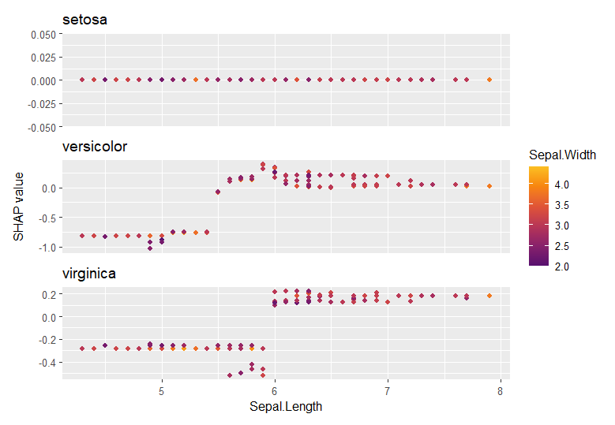

This vignette explains how to use {shapviz} with {Tidymodels}. 

XGBoost and LightGBM are shipped with super-fast TreeSHAP algorithms. Thus, doing a SHAP analysis is quite different from the normal case.

## Normal case

A model fitted with Tidymodels has a `predict()` method that produces a data.frame with predictions. Therefore, working with model-agnostic SHAP (permutation SHAP or Kernel SHAP) is as easy as it can get. But is takes a little bit of time.

```r
library(tidymodels)
library(kernelshap)
library(shapviz)

set.seed(10)

splits <- diamonds |> 
  transform(
    log_price = log(price),
    log_carat = log(carat)
) |> 
  initial_split()
df_train <- training(splits)

dia_recipe <- df_train |>
  recipe(log_price ~ log_carat + color + clarity + cut)

rf <- rand_forest(mode = "regression") |>
  set_engine("ranger")

rf_wf <- workflow() |>
  add_recipe(dia_recipe) |>
  add_model(rf)

fit <- rf_wf |>
  fit(df_train)
  
# SHAP analysis
xvars <- c("log_carat", "color", "clarity", "cut")
X_explain <- df_train[1:1000, xvars]  # Use only feature columns

# 1.5 minutes on laptop
# Note: If you have more than p=8 features, use kernelshap() instead of permshap()
system.time(
  shap_values <- fit |> 
    permshap(X = X_explain) |> 
    shapviz()
)
# saveRDS(shap_values, file = "shap_values.rds")
# shap_values <- readRDS("shap_values.rds")

shap_values |> 
  sv_importance("bee")

shap_values |> 
  sv_dependence(xvars)
``` 


## XGBoost

When your Tidymodel is an XGBoost or LightGBM model, you will almost always want to use their native TreeSHAP implementation. In this case, you need to pass to `shapviz()` the fully prepared explanation matrix `X_pred` and the underlying fit engine.

We will show how to prepare the inputs for `shapviz()`, namely

- the underlying fit engine,
- `X_pred`, the matrix passed to XGBoost's `predict()`,
- and optionally `X`, the dataframe used for visualizations (to see original factor levels etc).

Since XGBoost offers SHAP interactions, we additionally show how to integrate these into the analysis.
of course, you don't *have* to work with SHAP interactions, especially if your model has many predictors.

**Remark:** Don't use 1:m transforms such as One-Hot-Encodings. They are usually not necessary and make the workflow more complicated. If you can't avoid this, check the `collapse` argument in `shapviz()`.

```r
library(tidymodels)
library(shapviz)
library(patchwork)

set.seed(10)

splits <- diamonds |> 
  transform(
    log_price = log(price),
    log_carat = log(carat)
) |> 
  initial_split()
df_train <- training(splits)

dia_recipe <- df_train |>
  recipe(log_price ~ log_carat + color + clarity + cut) |> 
  step_integer(all_ordered())

# Should be tuned in practice
xgb_model <- boost_tree(mode = "regression", learn_rate = 0.1, trees = 100) |>
  set_engine("xgboost")

xgb_wf <- workflow() |>
  add_recipe(dia_recipe) |>
  add_model(xgb_model)

fit <- xgb_wf |>
  fit(df_train)

# SHAP Analysis
df_explain <- df_train[1:1000, ]

X_pred <- bake(  # Goes to xgboost:::predict.xgb.Booster()
  prep(dia_recipe), 
  has_role("predictor"),
  new_data = df_explain,
  composition = "matrix"
)

stopifnot(colnames(X_pred) %in% colnames(df_explain))

shap_values <- extract_fit_engine(fit) |> 
  shapviz(X_pred = X_pred, X = df_explain, interactions = TRUE)

# SHAP importance
shap_values |> 
  sv_importance(show_numbers = TRUE) +
  ggtitle("SHAP importance")

# Absolute average SHAP interactions (off-diagonals already multiplied by 2)
shap_values |> 
  sv_interaction(kind = "no")
#            log_carat     clarity       color         cut
# log_carat 0.87400688 0.067567245 0.032599394 0.024273852
# clarity   0.06756720 0.143393109 0.028236784 0.004910905
# color     0.03259941 0.028236796 0.095656042 0.004804729
# cut       0.02427382 0.004910904 0.004804732 0.031114735

# Usual dependence plot
xvars <- c("log_carat", "color", "clarity", "cut")

shap_values |> 
  sv_dependence(xvars, share_y = TRUE) +
  plot_annotation("SHAP dependence plots")

# SHAP interactions for carat
shap_values |> 
  sv_dependence("log_carat", color_var = xvars, interactions = TRUE) +
  plot_annotation("SHAP interactions for carat")
```


## LightGBM

Regarding SHAP analysis and Tidymodels, LightGBM is slightly different from XGBoost:

- It requires {bonsai}.
- It turns factors internally to integers and treats them as LightGBM categoricals. You should avoid this for factors with logical order, so don't forget to manually integer encode such factors in a recipe. For illustration only, we treat "cut" as unordered and let LightGBM use internal encodings.
- LightGBM does not offer SHAP interactions.

```r
library(tidymodels)
library(bonsai)
library(shapviz)

set.seed(10)

splits <- diamonds |> 
  transform(
    log_price = log(price),
    log_carat = log(carat)
) |> 
  initial_split()
df_train <- training(splits)

dia_recipe <- df_train |>
  recipe(log_price ~ log_carat + color + clarity + cut) |> 
  step_integer(color, clarity)  # we keep cut a factor (for illustration only)

# Should be tuned in practice
lgb_model <- boost_tree(mode = "regression", learn_rate = 0.1, trees = 100) |>
  set_engine("lightgbm")

lgb_wf <- workflow() |>
  add_recipe(dia_recipe) |>
  add_model(lgb_model)

fit <- lgb_wf |>
  fit(df_train)

# SHAP analysis
df_explain <- df_train[1:1000, ]

X_pred <- bake(   # Goes to lightgbm:::predict.lgb.Booster()
  prep(dia_recipe), 
  has_role("predictor"),
  new_data = df_explain
) |> 
  bonsai:::prepare_df_lgbm()
  
head(X_pred, 2)
#       log_carat color clarity cut
# [1,]  0.3148107     5       5   3
# [2,] -0.5978370     2       3   4

stopifnot(colnames(X_pred) %in% colnames(df_explain))

shap_values <- extract_fit_engine(fit) |> 
  shapviz(X_pred = X_pred, X = df_explain)

shap_values |> 
  sv_importance(show_numbers = TRUE)

shap_values |> 
  sv_dependence(c("log_carat", "color", "clarity", "cut"), share_y = TRUE)
```


## Probabilistic classification

For probabilistic classification, the code is very similar to above regression examples. 

`shapviz()` returns a list of "shapviz" objects (one per class). Sometimes, you might want to analyze them together, or select an individual class via `$name_of_interesting_class` or `[[`.

### Normal case

Simply pass `type = "prob"` to `kernelshap::kernelshap()` or `kernelshap::permshap()`:

```r
library(tidymodels)
library(kernelshap)
library(shapviz)
library(patchwork)

set.seed(1)

iris_recipe <- iris |> 
  recipe(Species ~ .)

fit <- rand_forest(trees = 100) |>
  set_engine("ranger") |> 
  set_mode("classification")
  
iris_wf <- workflow() |>
  add_recipe(iris_recipe) |>
  add_model(fit)

fit <- iris_wf |>
  fit(iris)

# SHAP analysis
X_explain <- iris[-5]  # Feature columns of <=2000 rows from the training data

system.time(  # 2s
  shap_values <- permshap(fit, X_explain, type = "prob") |> 
    shapviz()
)
sv_importance(shap_values)

shap_values |> 
  sv_dependence("Sepal.Length") +
  plot_layout(ncol = 1) +
  plot_annotation("SHAP dependence of one variable for all classes")

# Use $ to extract SHAP values for one class
shap_setosa <- shap_values$.pred_setosa

shap_setosa |> 
  sv_dependence(colnames(X_explain)) +
  plot_annotation("SHAP dependence of all variables for one class")
```





### XGBoost

For XGBoost and LightGBM, we again want to use its native TreeSHAP implementation.

We can slightly adapt the code from the regression example:

```r
library(tidymodels)
library(shapviz)
library(patchwork)

set.seed(1)

iris_recipe <- iris |>
  recipe(Species ~ .)

xgb_model <- boost_tree(learn_rate = 0.1, trees = 100) |>
  set_mode("classification") |> 
  set_engine("xgboost", verbose = -1)

xgb_wf <- workflow() |>
  add_recipe(iris_recipe) |>
  add_model(xgb_model)

fit <- xgb_wf |>
  fit(iris)
  
# SHAP analysis
df_explain <- iris  # Typically 1000 - 2000 rows from the training data

X_pred <- bake(  # goes to xgboost:::predict.xgb.Booster()
  prep(iris_recipe), 
  has_role("predictor"),
  new_data = df_explain,
  composition = "matrix"
)

stopifnot(colnames(X_pred) %in% colnames(df_explain))

shap_values <- extract_fit_engine(fit) |> 
  shapviz(X_pred = X_pred, X = df_explain) |> 
  setNames(levels(iris$Species))

shap_values |> 
  sv_importance()

shap_values |> 
  sv_dependence(v = "Sepal.Length", color_var = "Sepal.Width") +
  plot_layout(ncol = 1, guides = "collect")
```





### LightGBM (binary probabilistic)

Let's complete this vignette by running a binary LightGBM model.

```r
library(tidymodels)
library(bonsai)
library(shapviz)
library(patchwork)

set.seed(1)

# Make factor with two levels
iris$sl_large <- factor(
  iris$Sepal.Length > median(iris$Sepal.Length), labels = c("no", "yes")
)

iris_recipe <- iris |>
  recipe(sl_large ~ Sepal.Width + Petal.Length + Petal.Width + Species) # |> 
  # step_integer(some ordinal factors)
  
lgb_model <- boost_tree(learn_rate = 0.1, trees = 100) |>
  set_mode("classification") |> 
  set_engine("lightgbm", verbose = -1)

lgb_wf <- workflow() |>
  add_recipe(iris_recipe) |>
  add_model(lgb_model)

fit <- lgb_wf |>
  fit(iris)
  
# SHAP analysis
df_explain <- iris  # Typically 1000 - 2000 rows from the training data

X_pred <- bake(
  prep(iris_recipe), 
  has_role("predictor"),
  new_data = df_explain
) |> 
  bonsai:::prepare_df_lgbm()

stopifnot(colnames(X_pred) %in% colnames(df_explain))

shap_values <- extract_fit_engine(fit) |> 
  shapviz(X_pred = X_pred, X = df_explain)

shap_values |> 
  sv_importance()

shap_values |> 
  sv_dependence("Species")
```


