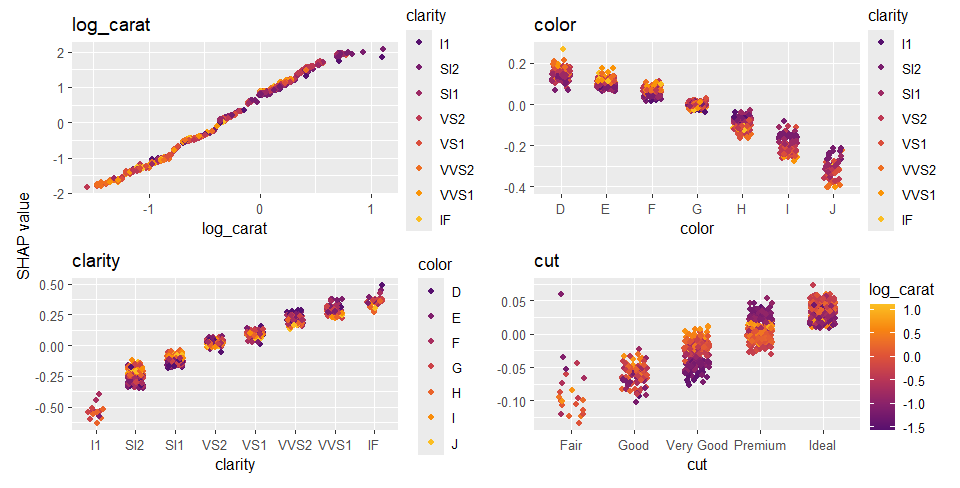
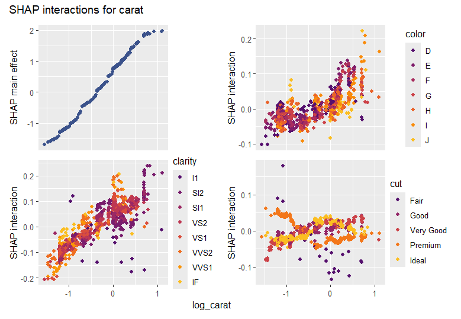
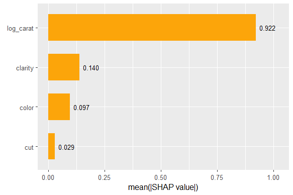

```{r, include = FALSE}
knitr::opts_chunk$set(
  collapse = TRUE,
  comment = "#>",
  warning = FALSE,
  message = FALSE,
  fig.height = 8, 
  fig.width = 10,
  fig.align = "center"
)
```


This vignette explains how to use {shapviz} with {Tidymodels}. 

XGBoost and LightGBM bring their super-fast native TreeSHAP implementation, so the workflow is quite different from the "normal" case.

## Normal Workflow

A model fitted with Tidymodels has a `predict()` method that produces a data.frame with predictions. Therefore, working with model-agnostic SHAP (permutation SHAP or Kernel SHAP) is as easy as it can get.

```r
library(tidymodels)
library(kernelshap)
library(shapviz)

set.seed(10)

splits <- initial_split(diamonds)
df_train <- training(splits)

dia_recipe <- df_train |>
  recipe(price ~ carat + color + clarity + cut)

rf <- rand_forest(mode = "regression") |>
  set_engine("ranger")

rf_wf <- workflow() |>
  add_recipe(dia_recipe) |>
  add_model(rf)

fit <- rf_wf |>
  fit(df_train)
  
# SHAP analysis
xvars <- c("carat", "color", "clarity", "cut")
X_explain <- df_train[1:1000, xvars]

# 90 seconds on my laptop
system.time(
  shap_values <- fit |> 
    kernelshap(X = X_explain) |> 
    shapviz()
)
# saveRDS(shap_values, file = "shap_values.rds")
# shap_values <- readRDS("shap_values.rds")

shap_values |> 
  sv_importance("bee")

shap_values |> 
  sv_dependence(xvars)
``` 



## XGBoost

When your model is an XGBoost or LightGBM model, you will almost always want to use their native TreeSHAP implementation. In this case, you will need to pass to `shapviz()` the fully prepared explanation data `X_pred` and the underlying fit engine. `X_pred` has to be a numeric matrix. To see original factor levels in the plot, you can accompany it with a "display" data `X` that is only used for visualization.

We show how to prepare the inputs for `shapviz()`, namely

- the underlying fit engine,
- `X_pred` (the matrix passed to XGBoost's `predict()`),
- and optionally `X`, the dataframe used for visualizations.

Since XGBoost also offers the options for SHAP interaction values, we additionally show how to integrate these into the analysis.
of course, you don't *have* to work with SHAP interactions, especially if your model has many predictors.

**Remark:** Don't use 1:m transforms such as One-Hot-Encodings. They are usually not necessary and make the workflow with TreeSHAP more complicated. If you can't avoid this, check the `collapse` argument in `shapviz()`.

```
library(tidymodels)
library(shapviz)
library(patchwork)

set.seed(10)

splits <- initial_split(diamonds)
df_train <- training(splits)

dia_recipe <- df_train |>
  recipe(price ~ carat + color + clarity + cut) |> 
  step_integer(all_ordered())

# Should be tuned in practice
xgb_model <- boost_tree(mode = "regression", learn_rate = 0.1, trees = 100) |>
  set_engine("xgboost")

xgb_wf <- workflow() |>
  add_recipe(dia_recipe) |>
  add_model(xgb_model)

fit <- xgb_wf |>
  fit(df_train)

# SHAP Analysis
df_explain <- df_train[1:1000, ]

X_pred <- bake(
  prep(dia_recipe), 
  has_role("predictor"),
  new_data = df_explain,
  composition = "matrix"
)

stopifnot(colnames(X_pred) %in% colnames(df_explain))

shap_values <- extract_fit_engine(fit) |> 
  shapviz(X_pred = X_pred, X = df_explain, interactions = TRUE)

# SHAP importance
shap_values |> 
  sv_importance(show_numbers = TRUE) +
  ggtitle("SHAP importance")

# Absolute average SHAP interactions (off-diagonals already multiplied by 2)
shap_values |> 
  sv_interaction(kind = "no")
#              carat  clarity     color       cut
# carat   2998.30769 591.8859 425.63902  99.11383
# clarity  591.88589 632.2544 192.14847  25.47713
# color    425.63906 192.1484 424.91991  20.15823
# cut       99.11392  25.4771  20.15823 109.26374

# Usual dependence plot
xvars <- c("carat", "color", "clarity", "cut")

shap_values |> 
  sv_dependence(xvars) +
  ggtitle(
    "SHAP dependence", subtitle = "Color variables selected via SHAP interactions"
  )

# SHAP interactions for carat
shap_values |> 
  sv_dependence("carat", color_var = xvars, interactions = TRUE) &
  plot_annotation("SHAP interactions for carat")  # patchwork magic
```




## LightGBM

To work with LightGBM is quite similar to XGBoost, with small differences:

- It requires {bonsai}.
- It turns factors internally to integers and treats them as LightGBM categoricals. This means typically: Use the recipe to turn ordered factors into integers and let unordered factors being dealt internally by LightGBM. *In our example, we artificially do as if "cut" is unordered (but it is not, of course).*
- `X_pred` can be a data frame ({bonsai} magic).
- LightGBM does not offer SHAP interactions.

```r
library(tidymodels)
library(bonsai)
library(shapviz)

set.seed(10)

splits <- initial_split(diamonds)
df_train <- training(splits)

dia_recipe <- df_train |>
  recipe(price ~ carat + color + clarity + cut) |> 
  step_integer(color, clarity)  # we keep cut a factor (for illustration only)

# Should be tuned in practice
lgb_model <- boost_tree(mode = "regression", learn_rate = 0.1, trees = 100) |>
  set_engine("lightgbm")

lgb_wf <- workflow() |>
  add_recipe(dia_recipe) |>
  add_model(lgb_model)

fit <- lgb_wf |>
  fit(df_train)

# SHAP analysis
df_explain <- df_train[1:1000, ]

X_pred <- bake(
  prep(dia_recipe), 
  has_role("predictor"),
  new_data = df_explain
) |> 
  bonsai:::prepare_df_lgbm()
  
head(X_pred, 2)
#      carat color clarity cut
# [1,]  1.37     5       5   3
# [2,]  0.55     2       3   4

stopifnot(colnames(X_pred) %in% colnames(df_explain))

shap_values <- extract_fit_engine(fit) |> 
  shapviz(X_pred = X_pred, X = df_explain)

shap_values |> 
  sv_importance(show_numbers = TRUE) +
  ggtitle("SHAP importance")

shap_values |> 
  sv_dependence(c("carat", "color", "clarity", "cut"))
```

